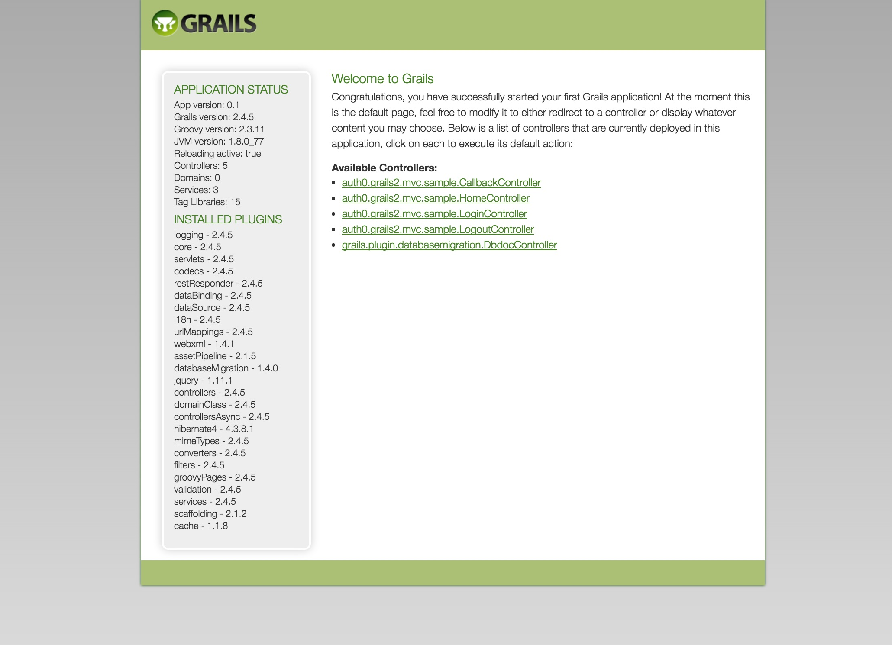
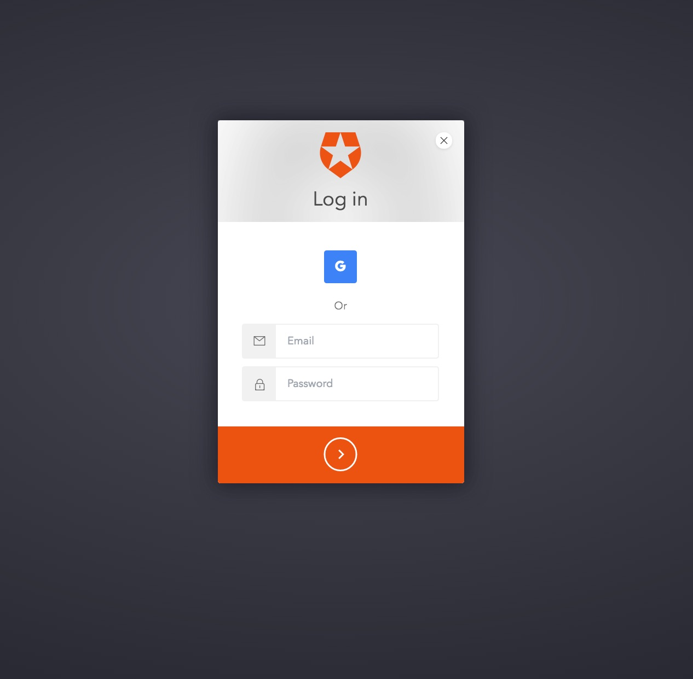

## Demonstrates using Auth0 with Grails 2 to create a Secured MVC Web Application

This is a companion sample for the [Auth0 Spring MVC](https://github.com/auth0/auth0-spring-mvc) library.
Please refer to that library and documentation for further information specific to the library itself.

Allows you to use Auth0 with Grails 2 in order to create a server-side MVC web apps. Leverages Spring Boot dependencies internally.
Validates the JWT from Auth0 in every API call to assert authentication according to configuration. If your application only needs secured
endpoints and the ability to programmatically work with a Principal object for GrantedAuthority checks this library is a good fit.

However, if you are already using Java Spring and wish to leverage fully Java Spring Security - with powerful support for Security Annotations, Security
JSTL Tag libraries, Fine-grained Annotation level method security and URL endpoint security at the Role / Group level - then see this project
[Auth0 Spring Security MVC](https://github.com/auth0/auth0-spring-security-mvc) and associated sample
[Auth0 Spring Security MVC Sample](https://github.com/auth0-samples/auth0-spring-security-mvc-sample)

Please note, we are currently working on Grails Samples to illustrate integration with the Auth0 Spring Security libraries.

### Prerequisites

In order to run this example you will need to have Java 7+, and Grails 2 installed.

Check the [Grails](https://grails.org/) documentation for details on installing `Grails 2`.
[sdkman](http://sdkman.io/) is one useful tool for this purpose.

Check installed successfully with:

```sh
grails --version
```

FYI only, in creating this sample, the following SDK versions were used:

 ```
Grails version: 2.4.5
Groovy Version: 2.4.7
JVM Version: 1.8.0_77
```

### Setup

Create an [Auth0 Account](https://auth0.com) (if not already done so - free!).


#### From the Auth0 Dashboard

Create an application - for the purposes of this sample - `app`

Ensure you add the following to the settings.

Allowed Callback URL:

```
http://localhost:3099/callback
```

Ensure you add the following to the settings.

Allowed Logout URLs:

```
http://localhost:3099/logout
```

Add one or more `connections` to your application - for instance Google Social Connection,
or username-password DB connection.


### Inside the Application - update configuration information

Enter your:

`client_id`, `client_secret`, and `domain` information into `grails-app/conf/auth0.properties`

An example of populated values is shown below (please use your own values):

```
auth0.domain: arcseldon.auth0.com
auth0.clientId: 7JbjgoK7BAuLL4AL6x8pOYfNSiBeZMdW
auth0.clientSecret: dn0p_95MmZKMDoXXXXXXXkE5Uu1Opo9oXXXXaho03P9Q907oHUE
```


### Build and Run

In order to build and run the project execute:

```sh
grails run-app
```

Then, go to [http://localhost:3099/](http://localhost:3099/).

The Gradle landing page has been left with the sample so you can see the Controllers used, and get general information
on the Grails application itself. Since it launches from the root URL it is unsecured and hence available on startup.

To login, go to [http://localhost:3099/login](http://localhost:3099/login) - you can click on the LoginController link if you like.

---

### Screenshots of the overall flow (minus growler notifications):


#### 1. Grails



#### 2.Login



#### 3. Home


That's it!

---


## License

The MIT License (MIT)

Copyright (c) 2013 AUTH10 LLC

Permission is hereby granted, free of charge, to any person obtaining a copy
of this software and associated documentation files (the "Software"), to deal
in the Software without restriction, including without limitation the rights
to use, copy, modify, merge, publish, distribute, sublicense, and/or sell
copies of the Software, and to permit persons to whom the Software is
furnished to do so, subject to the following conditions:

The above copyright notice and this permission notice shall be included in
all copies or substantial portions of the Software.

THE SOFTWARE IS PROVIDED "AS IS", WITHOUT WARRANTY OF ANY KIND, EXPRESS OR
IMPLIED, INCLUDING BUT NOT LIMITED TO THE WARRANTIES OF MERCHANTABILITY,
FITNESS FOR A PARTICULAR PURPOSE AND NONINFRINGEMENT. IN NO EVENT SHALL THE
AUTHORS OR COPYRIGHT HOLDERS BE LIABLE FOR ANY CLAIM, DAMAGES OR OTHER
LIABILITY, WHETHER IN AN ACTION OF CONTRACT, TORT OR OTHERWISE, ARISING FROM,
OUT OF OR IN CONNECTION WITH THE SOFTWARE OR THE USE OR OTHER DEALINGS IN
THE SOFTWARE.
